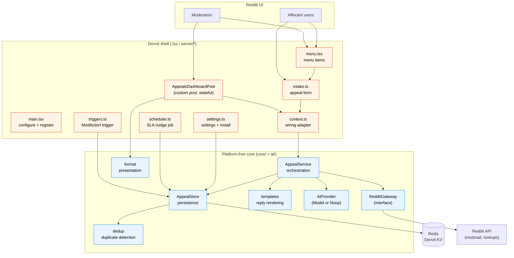
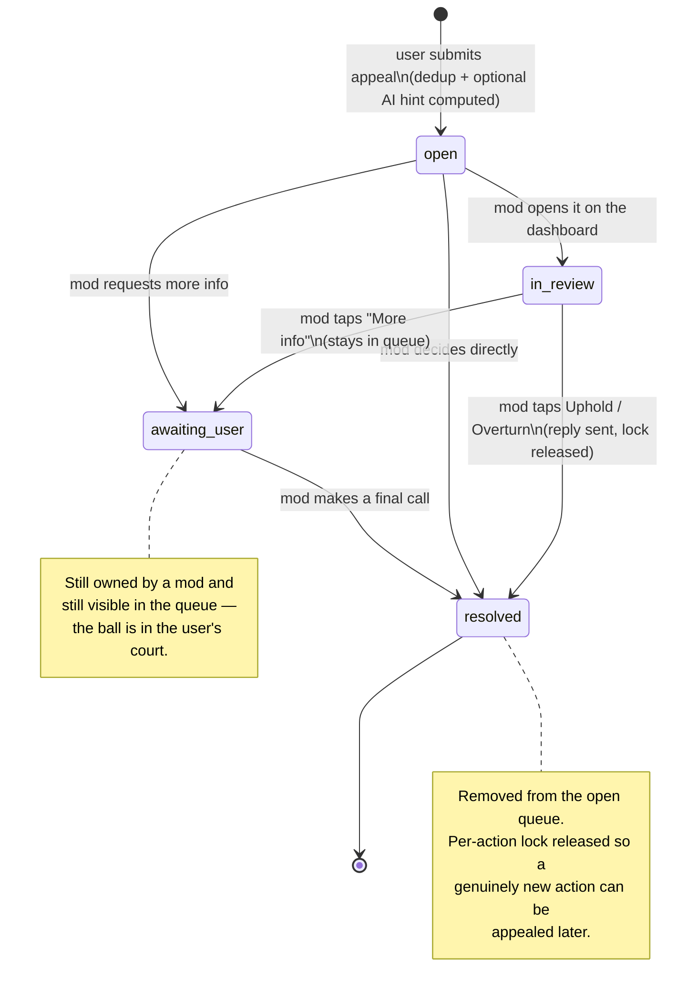
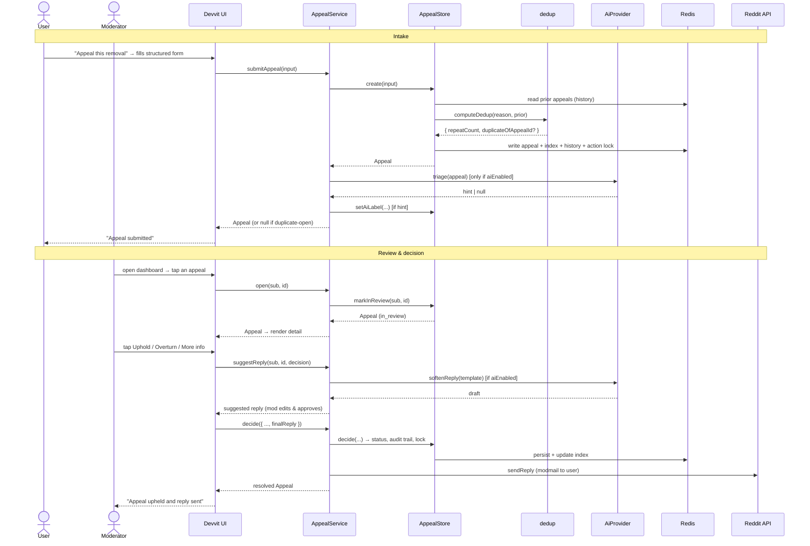
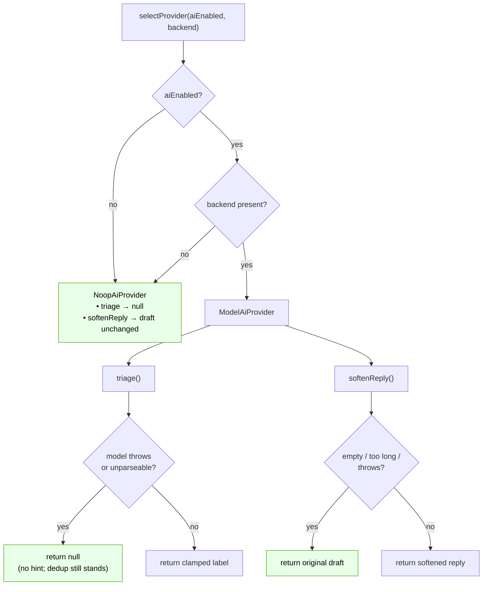
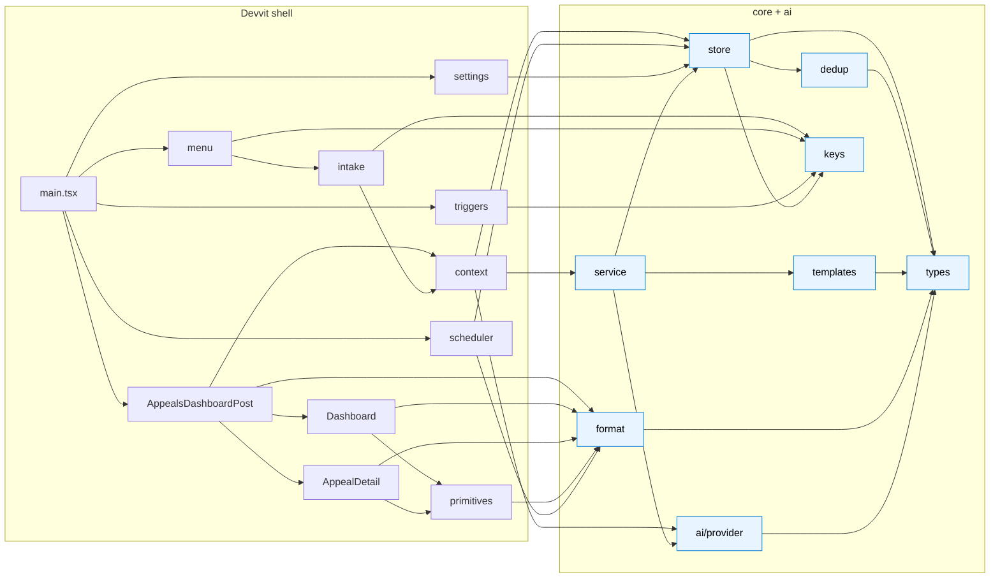
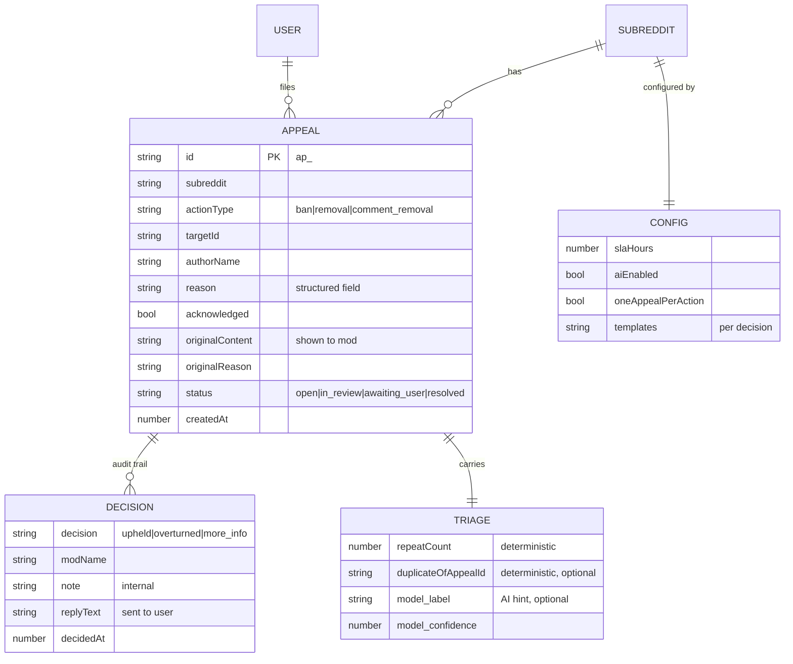
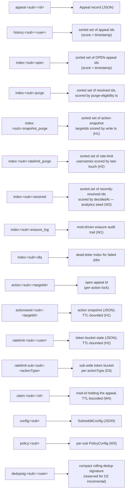
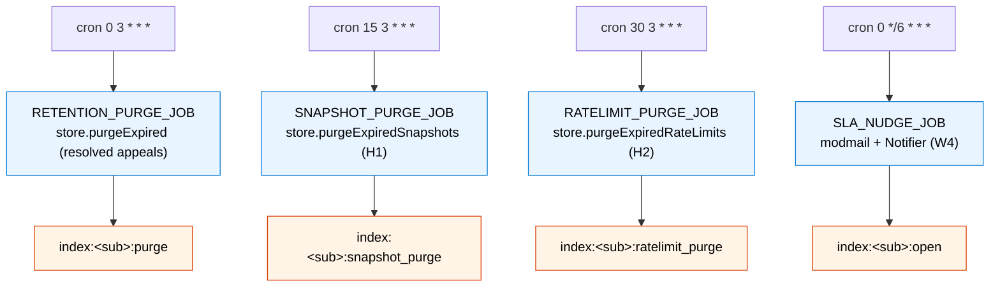

# Appealdesk — Architecture & Flow

This document is the visual companion to the README. Every diagram below is a
[Mermaid](https://mermaid.js.org/) diagram, which renders automatically on GitHub
and in most Markdown viewers. They cover: the layered architecture, the appeal
lifecycle state machine, the end-to-end intake and decision sequences, the module
dependency graph, the AI provider selection logic, and the data/Redis model.

---

## 1. Layered architecture

The guiding principle: **all real logic lives in a platform-free core**, and the
Devvit-specific code is a thin shell that injects `redis`, `reddit`, and an optional
`ai` backend into that core.

**Why it's shaped this way:** the core imports nothing from Devvit, so it can be
unit-tested to 100% coverage with an in-memory fake Redis and fake gateway/AI. The
only code that touches Redis is `AppealStore`; the only adapter from Devvit context
to the core is `context.ts`.

---

## 2. Appeal lifecycle (state machine)

An appeal moves through four states. The per-action lock is released only when an
appeal reaches `resolved`.

---

## 3. End-to-end sequence: intake → decision

The single invariant across this whole sequence: **the decision is the mod's tap**,
and the reply is mod-approved before `sendReply` is ever called. AI appears only as
`triage` (a hint) and `softenReply` (a draft).

---

## 4. AI provider selection (graceful degradation)

This is the logic that guarantees the app works fully with AI switched off.

Every failure path lands on a safe deterministic outcome (green). The `backend` is
populated only when the runtime exposes `context.ai.generateText`; the current Devvit
SDK does not, so in practice `selectProvider` returns the `NoopAiProvider`.

---

## 5. Module dependency graph

Arrows point from a module to what it depends on. Note that nothing in `core/` or
`ai/` points into the Devvit shell — the dependency direction is strictly inward.

---

## 6. Data & Redis model

Redis keys backing the above (all built in `core/keys.ts`; the `KEY_DESCRIPTIONS`
table in that module is the canonical source — this section is rendered from it):

### 6.1 Retention scheduler (Doc-6)

Three of the index families above are driven by recurring cron jobs registered
in `server/scheduler.ts`. Each is a bounded-batch sweeper: a job pulls at most
`limit` entries due before `now`, deletes them, and the cron re-fires the next
day so a backlog drains over time rather than spiking one run.

Each sweep is **idempotent and bounded**: a sweeper deletes only entries whose
TTL has elapsed (or whose retention score is past `now`). TTLs at write time
are the primary defence; the index sweep is the deterministic belt-and-braces
so a host with drifting TTL semantics still maintains the invariants.

---

## 7. Reading guide

If you're reviewing the code, a good path is:

1. `core/types.ts` — the vocabulary everything else speaks.
2. `core/dedup.ts` — the deterministic value driver, in isolation.
3. `core/store.ts` — how state is persisted and indexed.
4. `core/service.ts` — how a request becomes a decision.
5. `ai/provider.ts` — how the optional layer stays optional.
6. `components/AppealsDashboardPost.tsx` — how the UI drives the service.
7. `server/*` — the triggers, scheduler, settings, and menu wiring.

Then run `npm test` to watch the whole core prove itself.
